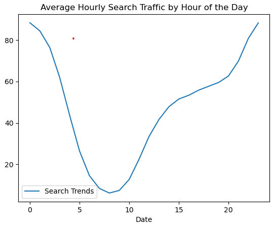

# prophet-challenge
Module 8 Challenge (prophet-challenge)

## Overview
With over 200 million users, Mercado Libre is the most popular e-commerce site in Latin America. This is to analyze the company's financial and user data in clever ways to make the company grow. We need to find out if the ability to predict search traffic can translate into the ability to successfully trade the stock. The analysis focuses on identifying unusual patterns in search traffic and comparing them to the company's financial events, particularly around the time MercadoLibre released its quarterly financial results in May 2020.

## Hourly Google Search Traffic
Search trend is mostly uniform throught the month of May with only an exception within the fist week where there were more searches, which is probably related to the release of financial results

## Search Traffic Data Seasonality
The search traffic obviosly increases throught the day

## Search Traffic to Stock Price Patterns relationship

## Time Series Model with Prophet

