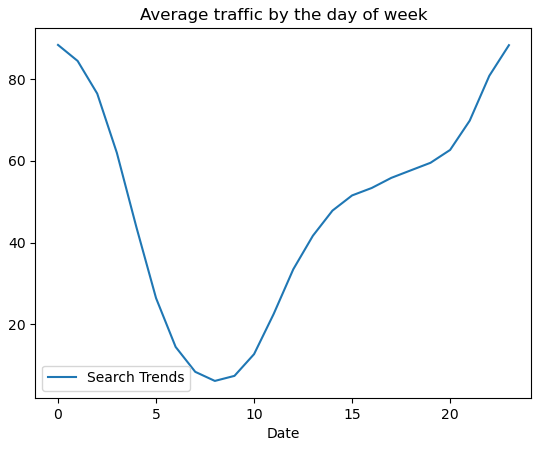

# prophet-challenge
Module 8 Challenge (prophet-challenge)

## Overview
With over 200 million users, Mercado Libre is the most popular e-commerce site in Latin America. This is to analyze the company's financial and user data in clever ways to make the company grow. We need to find out if the ability to predict search traffic can translate into the ability to successfully trade the stock. The analysis focuses on identifying unusual patterns in search traffic and comparing them to the company's financial events, particularly around the time MercadoLibre released its quarterly financial results in May 2020.

## How
-   Time-Series data of Google search trends for MercadoLibre
-   The data covers several months and is indexed hourly, providing a detailed view of search interest over time.
-   Visualization of search trends to identify patterns, spikes, and dips.
-   Comparing data

## Hourly Google Search Traffic
Search trend is mostly uniform throught the month of May with only an exception within the fist week where there were more searches, which is probably related to the release of financial results

## Search Traffic Data Seasonality
The search traffic is higher in the morning and fading through out the day

## Search Traffic to Stock Price Patterns relationship
If we cab track and predict interest in the company and its platform for any time of day, we can focus marketing efforts around the times that have the most traffic. This will get a greater return on investment (ROI) from their marketing budget.

## Time Series Model with Prophet
It seems the popularity is very early in the **morning** and the late **evening**, and **Tuesday** being the most **busiest**. **October** shows to be the lowest traffic in the calenfer year.

